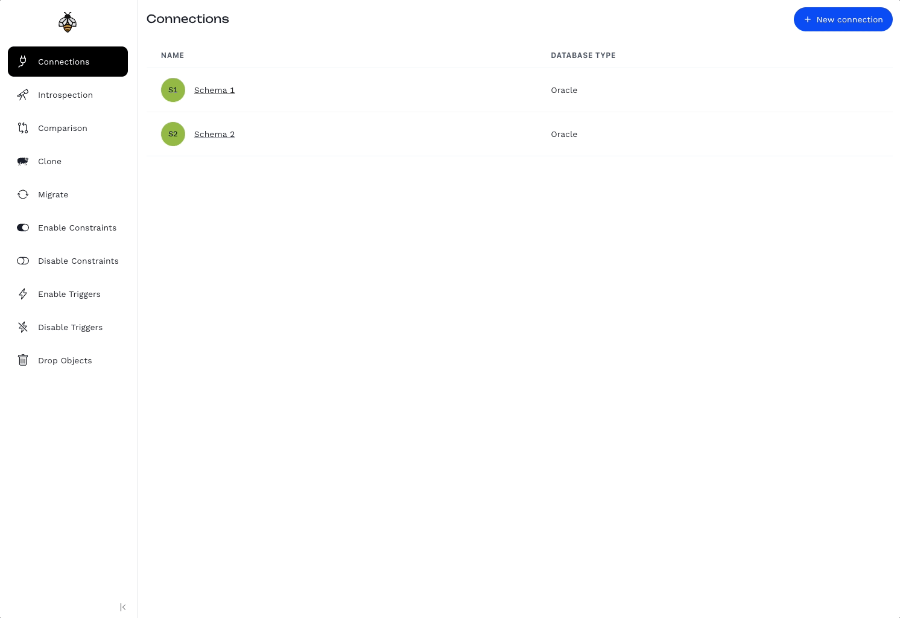

<!-- markdownlint-disable MD033 MD041 -->
<p align="center">
  
  <h1 align="center">Rolldebee</h1>
</p>

Rolldebee brings the power of CI/CD to the database. Setting up a local sandbox or synchronizing two environments is just a few of clicks away, it can be further automated by invoking Rolldebee's REST APIs from your favourite CI server.



## Getting Started

Build:

```shell
docker compose build
```

Run:

```shell
docker compose up -d
```

## Development

To setup a development environment for the purpose of developing and debugging Rolldebee, please read the development documentation available [here](DEVELOPMENT.md).

## Licensing

Rolldebee is released under the [GNU Affero General Public License v3.0](./LICENSE).
